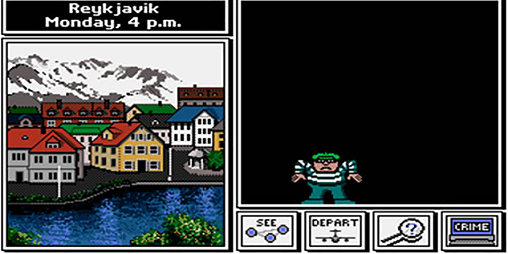

# <h1 align=center> **-THE PANDAS MURDER MYSTERY SOLUTION-** </h1>

## 
 ¡Pandas City te está nesecitando!  

Si te gusta develar historias de detectives y policiales vas a disfrutar mucho el echar un ojo en este repositorio!
En el mismo se plantea la solución al entretenido desafio planteado por https://github.com/facu-corvalan quién diseñó un juego para impulsar tu conocimiento sobre el mundo de los datos y desempeño en Pandas.
Inspirado en un juego originalmente diseñado para SQL nos son traídos no uno, sino dos niveles de dificultad para resolver el misterio sobre un asesinato en la ciudad ficticia Pandas City, colocándote en el personaje de detective con el cual tendrás que seguir las pistas y utilizar tus conocimientos sobre tablas, máscaras y búsquedas con dataframes.

En este respositorio agrego una de las soluciones para que una vez que completes el nivel principiante puedas comparar tu camino hacia la solución con el mío.

## Créditos

Los archivos originales y el juego original lo podés encontrar en el repositorio de [Facundo Corvalán](https://github.com/facu-corvalan).
Este proyecto está basado en el popular [The SQL Murder Mystery](https://mystery.knightlab.com/) y adaptado para aprender Pandas.

---
