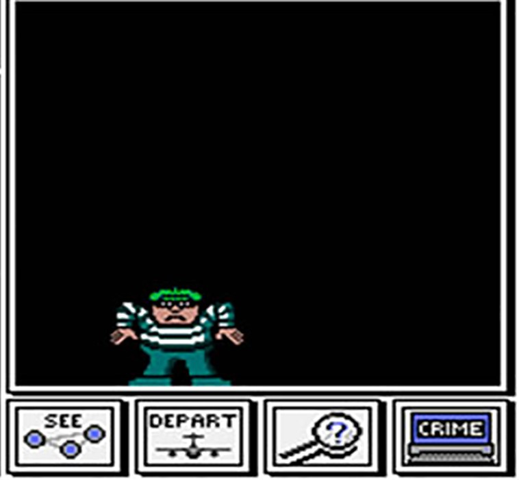

# <h1 align=center> **-THE PANDAS MURDER MYSTERY SOLUTION-** </h1>

## 
 Pandas City needs you!  

If you enjoy unraveling detective and crime stories, you will love taking a look at this repository!
It presents the solution to the entertaining challenge designed by https://github.com/facu-corvalan, who created a game to enhance your knowledge about the world of data and performance in Pandas.
Inspired by a game originally designed for SQL, we are presented with not one, but two difficulty levels to solve the mystery of a murder in the fictional city of Pandas City, placing you in the role of a detective where you must follow the clues and use your knowledge of tables, masks, and searches with dataframes.

In this repository, I add one of the solutions so that once you complete the beginner level, you can compare your path to the solution with mine.

## Credits

The original files and the original game can be found in the repository of [Facundo Corvalán](https://github.com/facu-corvalan).
This project is based on the popular [The SQL Murder Mystery](https://mystery.knightlab.com/) and adapted for learning Pandas.

---

## 
 ¡Pandas City te está nesecitando!  

Si te gusta develar historias de detectives y policiales vas a disfrutar mucho el echar un ojo en este repositorio!
En el mismo se plantea la solución al entretenido desafio planteado por https://github.com/facu-corvalan quién diseñó un juego para impulsar tu conocimiento sobre el mundo de los datos y desempeño en Pandas.
Inspirado en un juego originalmente diseñado para SQL nos son traídos no uno, sino dos niveles de dificultad para resolver el misterio sobre un asesinato en la ciudad ficticia Pandas City, colocándote en el personaje de detective con el cual tendrás que seguir las pistas y utilizar tus conocimientos sobre tablas, máscaras y búsquedas con dataframes.

En este respositorio agrego una de las soluciones para que una vez que completes el nivel principiante puedas comparar tu camino hacia la solución con el mío.

## Créditos

Los archivos originales y el juego original lo podés encontrar en el repositorio de [Facundo Corvalán](https://github.com/facu-corvalan).
Este proyecto está basado en el popular [The SQL Murder Mystery](https://mystery.knightlab.com/) y adaptado para aprender Pandas.

---
